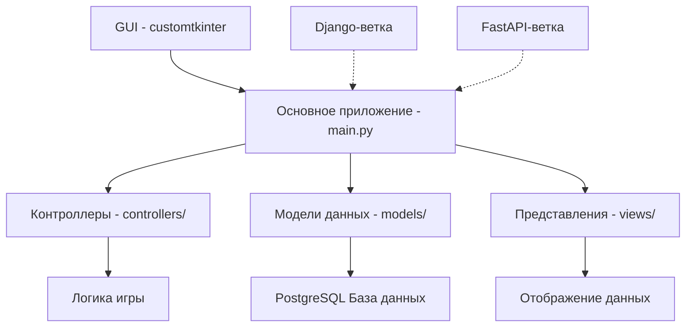

# 🎲 DNDGame — Casual D&D Adventure

**DNDGame** — это десктопное приложение для любителей настольных ролевых игр, построенное на базе `customtkinter`. Проект находится в активной разработке и позволяет создавать персонажей, распределять их характеристики, совершать броски кубиков и проходить приключения с ветвящимся сюжетом.

> **Статус проекта:** Активная разработка. Основной функционал работает, но интерфейс и механики боя активно дорабатываются.

---

## 📋 Содержание
- [Установка и запуск](#-установка-и-запуск)
- [Настройка базы данных](#-настройка-базы-данных)
- [Что уже сделано](#-что-уже-сделано)
- [Планы по развитию](#-планы-по-развитию)
  - [Ближайшие задачи](#ближайшие-задачи-приоритет-высокий)
  - [Будущие версии](#будущие-версии)
- [Техническая архитектура (планируемая)](#-техническая-архитектура-планируемая)

---

## 🚀 Установка и запуск

### Требования
- Python 3.8 или выше
- Git
- PostgreSQL (локально или удаленный сервер)

### Инструкция

1. **Клонируйте репозиторий:**
   ```bash
   git clone https://github.com/Sanyochik/dndgame.git
   cd dndgame
   ```
2. **Установите зависимости:**
    ```bash
   pip install -r requirements.txt
   ```
3. **Настройте базу данных информация ниже**
4. **Запустите приложение:**
    ```bash
    pip install -r requirements.txt
    ```
## 🗄️ **Настройка базы данных**
Проект использует PostgreSQL для хранения данных. Для корректной работы необходимо создать файл .env в корневой папке проекта на основе примера.
1. **Создайте файл .env**
Скопируйте содержимое из .env.example и создайте файл .env:

```bash
cp .env.example .env
```
2. **Заполните параметры подключения**
```env
DB_HOST=localhost
DB_NAME=your_database
DB_USER=your_username
DB_PASSWORD=your_password
```
| Параметр    | Описание                 | Пример      |
|-------------|--------------------------|-------------|
| DB_HOST     | Адрес сервера PostgreSQL | localhost   |
| DB_NAME     | Название базы данных     | dndgame     |
| DB_USER     | Имя пользователя БД      | postgres    |
| DB_PASSWORD | Пароль пользователя БД   | secure_pass |
3. **Создайте базу данных**
Если база данных еще не создана, выполните в терминале:
```sql
CREATE DATABASE dndgame;
```
Или используйте команду psql:
```bash
createdb -U your_username dndgame
```
📊**Структура базы данных**
Проект использует следующую структуру таблиц:

Таблица users (пользователи/персонажи)
Хранит информацию о всех игровых персонажах и их характеристиках.

| Поле     | Тип         | описание                 | Ограничения |
|----------|-------------|--------------------------|-------------|
| id       | SERIAL      | Уникальный идентификатор | PRIMARY KEY |
| username | VARCHAR(50) | Имя персонажа            | -           |
| str      | INTEGER     | Значение силы            | -           |
| chr      | INTEGER     | Значение харизмы         | -           |
| vit      | INTEGER     | Значение жизненной силы  | -           |

Таблица events (события приключений)
Хранит все возможные события, которые могут произойти во время приключения.

| Поле        | Тип          | описание                                       | Ограничения |
|-------------|--------------|------------------------------------------------|-------------|
| id          | SERIAL       | Уникальный идентификатор                       | PRIMARY KEY |
| title       | VARCHAR(50)  | Название события                               | -           |
| description | VARCHAR(200) | Описание события                               | -           |
| img_url     | VARCHAR(200) | URL изображения для события                    | -           |
| str_dif     | INTEGER      | Сложность проверки силы                        | -           |
| chr_dif     | INTEGER      | Сложность проверки харизмы                     | -           |
| vit_dif     | INTEGER      | Здоровье противника                            | -           |
| str_ans     | VARCHAR(200) | Текст ответа при успешной победе путём силы    | -           |
| chr_ans     | VARCHAR(200) | Текст ответа при успешной победе путём харизмы | -           |
| dmg         | INTEGER      | Урон, получаемый при провале                   | -           |

🏗️ **Создание таблиц**
Выполните следующие SQL-запросы для создания структуры базы данных:
```sql
-- Создание таблицы пользователей
CREATE TABLE IF NOT EXISTS users (
    id SERIAL PRIMARY KEY,
    username VARCHAR(50),
    str INTEGER,
    chr INTEGER,
    vit INTEGER
);

-- Создание таблицы событий
CREATE TABLE IF NOT EXISTS events (
    id SERIAL PRIMARY KEY,
    title VARCHAR(50),
    description VARCHAR(200),
    img_url VARCHAR(200),
    str_dif INTEGER,
    chr_dif INTEGER,
    vit_dif INTEGER,
    str_ans VARCHAR(200),
    chr_ans VARCHAR(200),
    dmg INTEGER
);
```
4. **Проверьте подключение**
При запуске приложение автоматически подключится к базе данных и создаст необходимые таблицы (если они отсутствуют).
## ✅ **Что уже сделано**

| № | Функция                                | Описание                                                                    |
|---|----------------------------------------|-----------------------------------------------------------------------------|
| 1 | Вывод пользователей из БД              | Отображение списка всех созданных персонажей                                |
| 2 | Создание пользователей                 | Создание новых пользователей                                                |
| 3 | Распределение очков характеристик      | Интерактивная система распределения характеристик (сила, харизма, здоровье) |
| 4 | Бросок кубика                          | Симуляция броска Д20 кубика                                                 |
| 5 | Получение списка событий в приключении | Получение списка всех событий которые могут встретиться в преключении       |

## 🗺️ Планы по развитию

## Ближайшие задачи (Приоритет: высокий)

□ Окно сражения — полноценный графический интерфейс для боевой системы

□ Экран поражения — модальное окно или сцена при гибели персонажа

□ Экран победы — анимированный или информативный экран при успешном завершении битвы

□ Функции боя:

□ Получение урона (визуальное отображение потери HP)

□ Нанесение урона (интерактивные кнопки атак)

□ Написание Unit-тестов — покрытие критической логики

## Будущие версии

🌐 **Версия на Django (веб-интерфейс)**
Планируется создание отдельной ветки django-version, которая реализует:

Полноценный веб-сайт с игровым интерфейсом

Визуализацию приключений и боев в браузере

⚡ **Версия на FastAPI (API-ориентированная)**
Ветка fastapi-version позволит:

Запустить игру как отдельный API-сервис

Интегрировать игровую логику в Telegram-бота, мобильные приложения или другие платформы

Обеспечить гибкое масштабирование игровых сессий

## Техническая архетиктура (планируемая)
